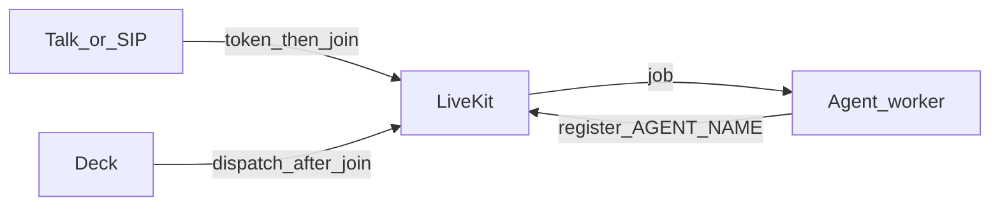

# Connect an agent starter to Deck

Use the [LiveKit Agents Python starter](https://github.com/livekit-examples/agent-starter-python) (this repo’s clone is `agent-starter-python/`) with the **same LiveKit URL, API key, and secret** as your Deck project.



Talk mints a browser token first, the client joins, **then** Deck dispatches the worker. Dispatching into an empty room makes SIP-style agents hang up.

## Env the worker needs

| Variable | Host worker (`uv run`) | Docker worker (Agents → Deploy) |
|---|---|---|
| `LIVEKIT_URL` | `ws://127.0.0.1:7880` | `ws://livekit:7880` (Deck overlays this) |
| `LIVEKIT_API_KEY` | Project API key | Overlaid from the project |
| `LIVEKIT_API_SECRET` | Project API secret | Overlaid from the project |
| `AGENT_NAME` | Must match Deploy / dispatch | Set in the Deploy form |
| STT / TTS / LLM / realtime keys | Starter `.env.local` | Same file; Deploy copies it |

Optional Deck extras (Deploy sets these when running from the host UI):

| Variable | Purpose |
|---|---|
| `AGENT_ENTRYPOINT` | e.g. `src/agent.py` or `src/agant.py` |
| `DECK_TRANSCRIPT_URL` | `http://host.docker.internal:3000/api/projects/<id>/sessions/transcripts` |
| `DECK_TRANSCRIPT_SECRET` | Same value as Deck `.env` |
| `SKIP_CREDIT_CHECK` | `1` for console/demo if the agent checks billing |

Copy keys from Deck **Settings → Use with CLI** (secret from API keys / project create — Deck does not show stored secrets).

## Mode 1 — Deck Deploy (host UI)

Requires Deck running on the **host** (`npm run dev`) so Agents → Deploy can call `docker compose`.

1. Clone or copy `agent-starter-python` next to `livekit-dashboard`.
2. In Deck `.env` set `AGENT_BUILD_CONTEXT` to that folder (forward slashes, even on Windows).
3. Put **all** model keys in the starter `.env.local` (not in Deck `.env`).
4. Open **Agents** → Deploy worker. Set:
   - Agent name (this is what LiveKit dispatches)
   - Entrypoint (`src/agent.py` for the official starter, `src/agant.py` for this repo’s Mahindra worker)
5. Wait until the card shows **registered** (not unhealthy). A `failed to send session event` traceback after a room closes is noise.
6. Click **Talk**. Stay connected; the agent joins after you do.

Workers inside Compose always use `LIVEKIT_URL=ws://livekit:7880`. Do not point them at a Cloudflare `wss://` tunnel.

## Mode 2 — Run the starter on the host

Use this when Deck itself is the `deck` Compose service (no Docker-from-the-UI deploy).

```bash
cd agent-starter-python
cp .env.example .env.local   # or keep your existing file
# Set LIVEKIT_URL=ws://127.0.0.1:7880 and the project key/secret
uv sync
uv run src/agent.py start    # or: uv run src/agant.py start
```

`AGENT_NAME` in `.env.local` must match what you dispatch from **Agents → Talk** or **dispatch**. Register should log an `AW_…` worker id.

## Mode 3 — Talk, rooms, and recordings

- **Talk / Join** in the browser uses `ws://127.0.0.1:7880` (loopback WebRTC). Public `wss://` is for phones only.
- Deck starts an audio recording when the room starts (needs `livekit-egress` + GCS). Check **Egresses**, then **Sessions → Recordings** after the call ends.
- Console rooms are named `deck-console-…`. Keep the tab open at least 30–60 seconds so egress has audio to upload.

## Official starter vs this clone

| File | When to use |
|---|---|
| `src/agent.py` | Stock LiveKit starter (Gemma / LiveKit Inference, etc.) |
| `src/agant.py` | This repo’s production Mahindra / vCISO worker |

Do not use `lk agent create` against LiveKit Cloud for this self-hosted server. See [self-hosted deployments](https://docs.livekit.io/deploy/custom/deployments/).

## Troubleshooting

| Symptom | Likely cause |
|---|---|
| Agent **unhealthy** with `failed to send session event` | False alarm after the room closed; refresh — should be **registered** |
| Talk connects but nobody speaks | Dispatch happened before join, or Talk used public `wss://` instead of local `ws://` |
| Worker never registers | `LIVEKIT_URL` / key / secret mismatch, or `AGENT_NAME` differs from dispatch |
| No recordings | `livekit-egress` down, GCS not set, or the call ended in a few seconds |
| Credit / webhook reject on a real SIP call | Agent billing backend; use Skip credit check only for console/demo |
