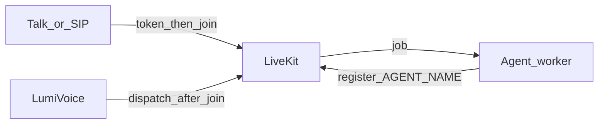

# Connect an agent starter to LumiVoice

Use the [LiveKit Agents Python starter](https://github.com/livekit-examples/agent-starter-python) (this repo’s clone is `agent-starter-python/`) with the **same LiveKit URL, API key, and secret** as your LumiVoice project.



Talk mints a browser token first, the client joins, **then** LumiVoice dispatches the worker. Dispatching into an empty room makes SIP-style agents hang up.

## Env the worker needs

| Variable | Host worker (`uv run`) | Docker worker (Agents → Deploy) |
|---|---|---|
| `LIVEKIT_URL` | `ws://127.0.0.1:7880` | `ws://livekit:7880` (LumiVoice overlays this) |
| `LIVEKIT_API_KEY` | Project API key | Overlaid from the project |
| `LIVEKIT_API_SECRET` | Project API secret | Overlaid from the project |
| `AGENT_NAME` | Must match Deploy / dispatch | Set in the Deploy form |
| STT / TTS / LLM / realtime keys | Starter `.env.local` | Same file; Deploy copies it |

Optional LumiVoice extras (Deploy sets these when running from the host UI):

| Variable | Purpose |
|---|---|
| `AGENT_ENTRYPOINT` | e.g. `src/agent.py` (Mahindra/vCISO worker) |
| `DECK_TRANSCRIPT_URL` | `http://host.docker.internal:3000/api/projects/<id>/sessions/transcripts` |
| `DECK_TRANSCRIPT_SECRET` | Same value as LumiVoice `.env` |
| `SKIP_CREDIT_CHECK` | `1` for console/demo if the agent checks billing |

Copy keys from LumiVoice **Settings → Use with CLI** (secret from API keys / project create).

## Mode 1 — LumiVoice Deploy (Docker UI or host UI)

When LumiVoice runs in Docker (`docker compose up deck`), **Agents → Deploy** works if the `deck` service has the Docker socket and compose project mount (see `docker-compose.yml`). Rebuild after pulling: `docker compose up -d --build deck`.

Alternatively run LumiVoice on the **host** (`npm run dev`) so Deploy calls `docker compose` from your machine.

1. Clone or copy `agent-starter-python` next to `livekit-dashboard`.
2. In LumiVoice `.env` set `AGENT_BUILD_CONTEXT` to that folder:
   - **Docker LumiVoice** (`docker compose up deck`): use `../agent-starter-python` in `.env` — the deck service overrides this to `./agent-starter-python` at deploy time.
   - **Host dev** (`npm run dev`): relative or absolute path is fine.
3. Put **all** model keys in the starter `.env.local` (not in LumiVoice `.env`).
4. Open **Agents** → Deploy worker. Set agent name and entrypoint (`src/agent.py` for Mahindra/vCISO).
5. Wait until the card shows **registered**.
6. Click **Talk**. Stay connected; the agent joins after you do.

Workers inside Compose always use `LIVEKIT_URL=ws://livekit:7880`. Do not point them at a Cloudflare `wss://` tunnel.

## Mode 2 — Run the starter on the host or VPS

Use this when LumiVoice runs in the `deck` Docker container (no Docker-from-the-UI deploy).

```bash
cd agent-starter-python
cp .env.example .env.local
# LIVEKIT_URL=ws://YOUR_SERVER:7880 and project key/secret
uv sync
uv run src/agent.py start
```

On a VPS, see [VPS-DEPLOY.md](./VPS-DEPLOY.md) section 9.

## Mode 4 — Deploy from any laptop (Cloud-style)

Like `lk agent deploy`, but for your VPS: [AGENT-DEPLOY-REMOTE.md](./AGENT-DEPLOY-REMOTE.md).

```bash
cd livekit-dashboard
cp .deploy.env.example .deploy.env   # set LV_DEPLOY_HOST
npm run agent:deploy:remote -- --push
```

## Mode 3 — Talk, rooms, and recordings

- **Talk / Join** in the browser uses `ws://127.0.0.1:7880` (loopback WebRTC). Public `wss://` is for phones only.
- LumiVoice starts an audio recording when the room starts (needs `livekit-egress` + GCS). Check **Egresses**, then **Sessions → Recordings** after the call ends.

## Official starter vs this clone

| File | When to use |
|---|---|
| `src/agent.py` | Mahindra / vCISO production worker (LiveKit starter layout) |
